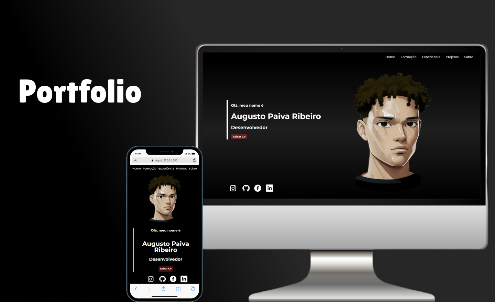

# PORTIFOLIO

    

## Tecnologias 💻

Esse projeto foi desenvolvido com as seguintes tecnologias:

-HTML e CSS  
-GitHub e Github Desktop

## Projeto 😁

Este site Portfolio foi um projeto construído na faculdade, de forma a desenvolver meus conhecimentos sobre o Front-end, e também é uma maneira de apresentar meus projetos de maneira mais rápida.
 
